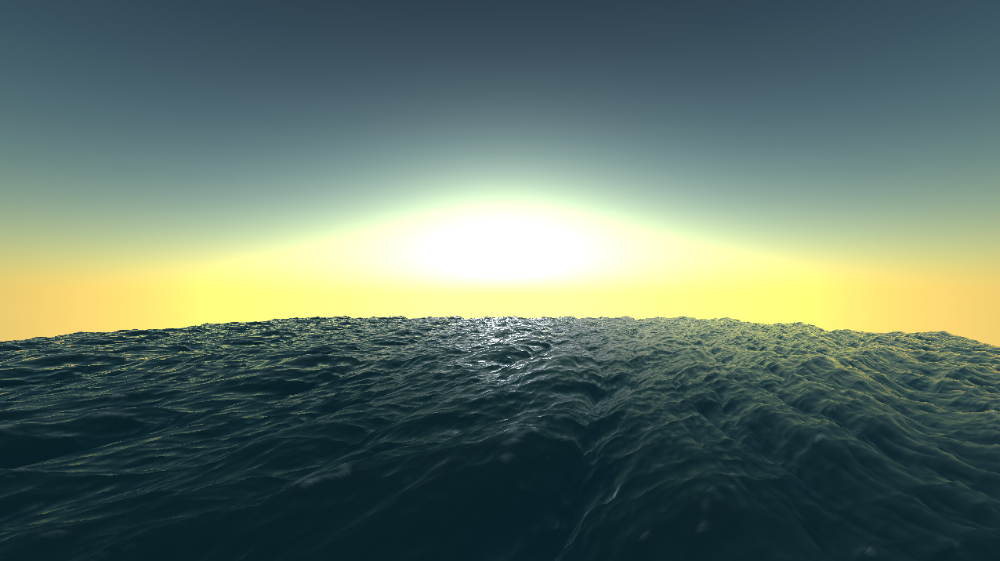
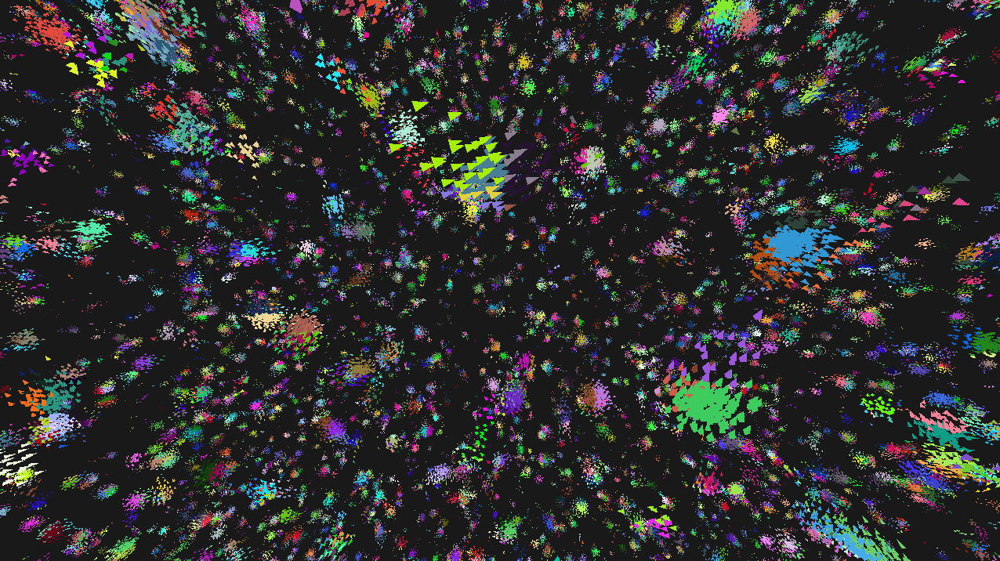
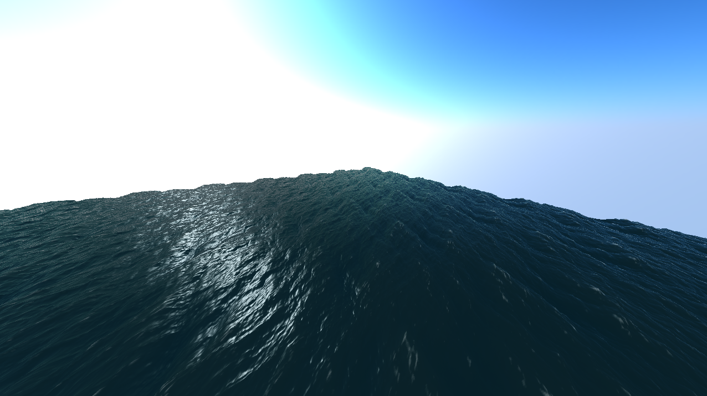

# Renderer features
* Easy and simple pipeline
* Geometry instancing
* Automatic mesh construction of different predetermined geometric shapes (triangle, tetrahedron, cube, plane and sphere)
* Abstraction of compute shaders, structured buffers, constant buffers, UAVs and SRVs for ease of use
* Ability to generate normal map from displacement map or height map

# Boids scene
* GPU-based boids simulation
* Uses a dynamic hashed grid on the GPU to accelerate nearest neighbor search (explained here: [https://wickedengine.net/2018/05/21/scalabe-gpu-fluid-simulation/](https://wickedengine.net/2018/05/21/scalabe-gpu-fluid-simulation/))
* Bitonic sort was implemented for sorting boids based on cell IDs
* Threads within thread groups operate on boids spatially close to eachother to better utilize cache coherence
* An option was implemented to evaluate only even/odd boids every other frame. It could give a 50% speed increase at the expense of an accurate simulation (although only really noticable on groups containing 1-3 boids). This option is disabled by default, but can be enabled in the compute shader.

The unoptimized O(n^2) GPU computations could at best handle 64K boids with 10 fps on average. The following benchmarks demonstrate the effects of the optimizations and were performed on a GTX 1070.
|                               | 256K boids | 512K boids | 1 million boids |
| :---                                         |  :---:  |  :---:  |  :---: |
| grid                                         | 140 fps | 21 fps  | 3 fps  |
| grid + cache coherence                       | 249 fps | 76 fps  | 27 fps |
| grid + cache coherence + even/odd evaluation | 292 fps | 107 fps | 44 fps |

# FFT ocean scene
* Procedural ocean wave animations through a GPU-based IFFT
* Basic ocean shading (foam, reflection, refraction, specular)
* Procedural skybox using the Preetham sky model

The IFFT is performed 3 times, once for each axis, and is applied to a 256x256 vertex grid. The same mesh is then rendered 49 times with different positions in a 7x7 fashion, with seamless edges between eachother. The skybox is recalculated each frame as the "sun" rotates around the scene. All of this together with shading, is executed in about 500 fps on a GTX 1070.

